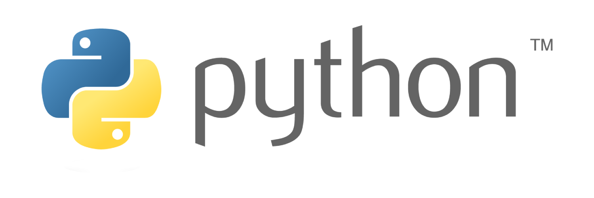

<p align="center">
  <a href="https://www.python.org/" target="_blank">
    
  </a>
</p>

<h1 align="center">⭐ Customer Churn Prediction ⭐</h1>

<p align="center">
  
</p>

<p align="center">
  <a href="https://www.python.org/" target="_blank">
    
  </a>
  <a href="https://www.docker.com/">
    
  </a>
</p>

## Requirements

- [Docker Deskptop](https://www.docker.com/products/docker-desktop/)
- [Python 3.12](https://www.python.org/)
- [PostgreSQL](https://www.postgresql.org/)
- [Poetry](https://python-poetry.org/)

## Project setup

- Setting up the db

```bash
  cd containers
  docker-compose up -d 
```

- Installing the Package Manager

```bash
  pip install poetry
```

- Create the db and load the data

```bash
  poetry run config
```

## License

Nest is [MIT licensed](https://github.com/nestjs/nest/blob/master/LICENSE).